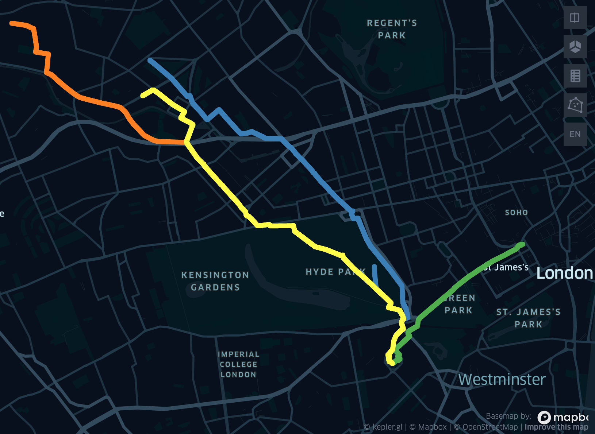
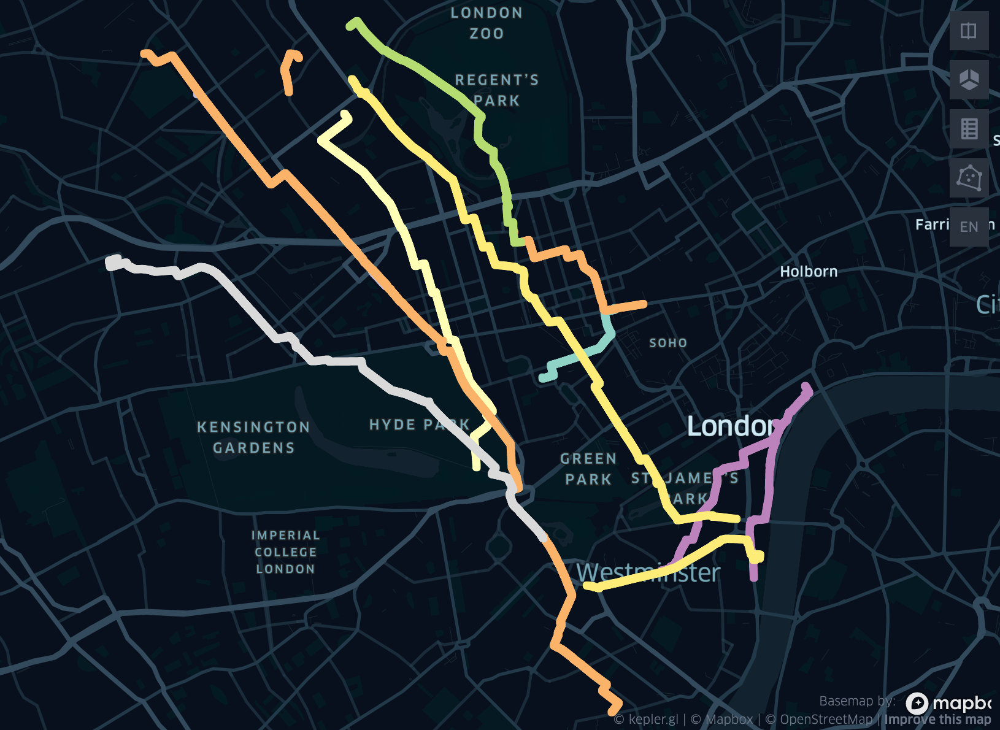

Examples
=====

Here's a basic example to get you started with **movingpeople**:

"many-one" route creation
----
.. code-block:: bash

    from movingpeople import visualise_route, generate_routes
    import osmnx as ox

    # Search query for a geographic area
    query = "City of Westminster"
    # Get the walking network for the query location
    G = ox.graph.graph_from_place(query, network_type="walk", simplify=True)
    # Project the graph to WGS84
    Gp = ox.project_graph(G, to_crs="4326")

    # To make a single route with a randomised origin and fixed destination and randomised start time between a range.
    data = generate_routes(
                  Gp,
                  time_from="2020-02-26 21:42:53",
                  time_strategy="fixed",
                  route_strategy="many-one",
                  origin_destination_coords=[51.499127, -0.153522],
                  total_routes=5,
                  walk_speed=1.4,
                  frequency="1s",
                  )

    # Visualise the results in keplerGL
    visualise_route(data, 500)

In the example above, we first create a ``Graph`` object to define the transportation network. We then generate five routes which have the same start time, randomised origins and a fixed destinations.

Here are the results when visualised using keplerGL:

"many-many" route creation
----
.. code-block:: bash
   
    # To make a single route with a randomised origin and destination and randomised start time between a range.
    data = generate_routes(
                  Gp,
                  time_from="2020-02-26 21:42:53",
                  time_until="2020-02-26 22:42:53",
                  time_strategy="random",
                  route_strategy="many-many",
                  origin_destination_coords=None,
                  total_routes=12,
                  walk_speed=1.4,
                  frequency="1s",
                  )
       # Visualise the results in keplerGL
       visualise_route(data, 500)

This example makes twelve randomised routes, with each route having a randomised start time between a range.

Here are the results when visualised using keplerGL:

There are many more combinations to experiment with, but to summarise:
- Fixed and/or randomised origins
- Fixed and/or randomised destinations
- n number of routes
- Fixed or randomised route start times
- Flexible walking speed and point frequency along routes